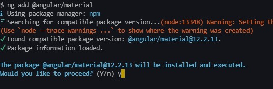
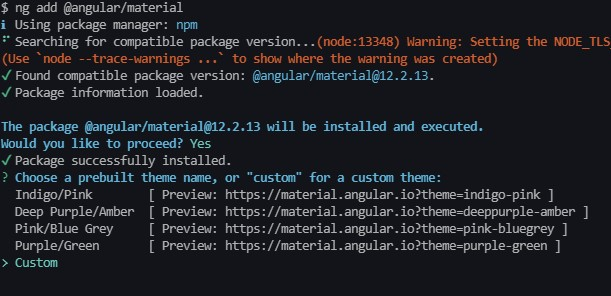
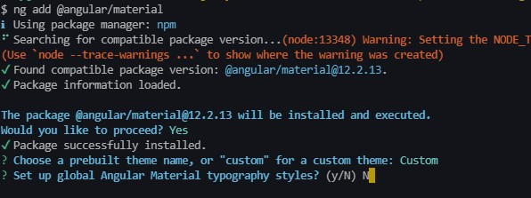
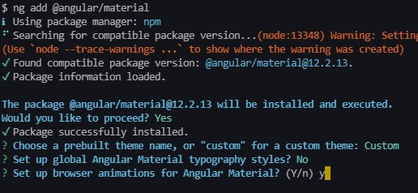

# Curso Angular 12 Mitocode

Este es un repositorio base usando la versión 12 de Angular, tengan en cuenta que las librerías que usemos pueden cambiar su implementación en el tiempo, asi que deben de adaptar el proyecto de acuerdo a esos cambios.

## Angular Material

Antes de instalar Angular material, asegurate de seleccionar la versión correcta según la versión de Angular de tu proyecto, en nuestro caso usaremos la versión 12:

```
ng add @angular/material
```

Cuando empieze a instalar nos dara varias opciones:



Cuando se muestre la opción de escoger un tema, nosotros usaremos la opción **"custom"**



Cuando se muestre la opción de usar la typografia diremos que **NO**



y por ultimo nos pedira si usaremos browser animation, le diremos que si, este módulo es para las animaciones:



Cuando finalize la instalación veremos que se habran modificado algunos archivos, el archivo **index.html** habra sufrido cambios, pero lo que haremos es reemplazar todo ese contenido por el siguiente:

```html
<!DOCTYPE html>
<html lang="es">
  <head>
    <meta charset="utf-8" />
    <title>MusicalEvent</title>
    <base href="/" />
    <meta name="viewport" content="width=device-width, initial-scale=1" />
    <link rel="icon" type="image/x-icon" href="favicon.ico" />
    <link rel="preconnect" href="https://fonts.googleapis.com" />
    <link rel="preconnect" href="https://fonts.gstatic.com" crossorigin />
    <link
      href="https://fonts.googleapis.com/css2?family=Roboto:ital,wght@0,100;0,300;0,400;0,500;0,700;0,900;1,900&display=swap"
      rel="stylesheet"
    />
    <link
      href="https://fonts.googleapis.com/css?family=Material+Icons|Material+Icons+Outlined|Material+Icons+Two+Tone|Material+Icons+Round|Material+Icons+Sharp"
      rel="stylesheet"
    />
  </head>
  <body>
    <app-root></app-root>
  </body>
</html>
```

## Migracion TSLint a ESLint Angular < v12

Recuerda que estos pasos solo aplica a las versiones que estan antes de la versión 12, ya que esas versiones usaban TSLint y generaban un archivo llamado **_tslint.json_**.

Ejecuta el siguiente comando en tu consola

```
ng add @angular-eslint/schematics
ng g @angular-eslint/schematics:convert-tslint-to-eslint --remove-tslint-if-no-more-tslint-targets --ignore-existing-tslint-config
```

Cuando termine de ejecutar esos comandos ya puedes eliminar el archivo **_tslint.json_**.

## Instalación EsLint Angular >= v12

Esta configuración solo aplica si usas angular versión 12 o superior.

```
ng add @angular-eslint/schematics
```

más información en: https://github.com/angular-eslint/angular-eslint

## Code Quality

1. Prettier
2. eslint-config-prettier
3. eslint-plugin-prettier

Ejecuta el siguiente comando en tu consola

```
npm install -D prettier eslint-config-prettier eslint-plugin-prettier
```

Luego dentro de tu archivo .eslinttrc.json agrega lo siguiente en la sección **extends** de las configuraciones para los archivos **.ts**
Configuración para los archivos TS:

```json
    		"extends": [
			        "plugin:@angular-eslint/recommended",
       			  "plugin:@angular-eslint/template/process-inline-templates",
       			  "eslint:recommended",
       			  "plugin:@typescript-eslint/recommended",
        		  "plugin:@typescript-eslint/recommended-requiring-type-checking",
       			  "plugin:prettier/recommended"
			]
```

Ahi mismo agregaremos unas reglas de exclusión en la sección de **rules**:

```json
		"rules": {
				"@angular-eslint/directive-selector": [
					"error",
					{
						"type": "attribute",
						"prefix": "app",
						"style": "camelCase"
					}
				],
				"@angular-eslint/component-selector": [
					"error",
					{
						"type": "element",
						"prefix": "app",
						"style": "kebab-case"
					}
				],
				"@typescript-eslint/unbound-method": [
					"error",
					{
						"ignoreStatic": true
					}
				],
				"@typescript-eslint/explicit-module-boundary-types": ["error"],
				"@typescript-eslint/no-non-null-assertion": "off"
			}
```

Configuración para los archivos HTML:

```json
	"extends": [
		  "plugin:@angular-eslint/template/recommended",
      "plugin:prettier/recommended"
			],
```

Si vas usar archivos **_.spec_** debes de ignorarlos ya que los archivos de test sirven para realizar simulaciones y el codigo que escribamos puede que no cumpla con las especificaciones de ESLint, para ignorarlos debes de agregar en la sección **ignorePatterns** lo siguiente:

```json
	"ignorePatterns": ["projects/**/*", "src/app/**/*.spec.ts"],
```

## Configurar archivos Prettier

Debes de crear los siguientes archivos en la raíz de tu proyecto:

1. .prettierrc
2. .prettierignore

dentro del archivo **.prettierrc** coloca lo siguiente:

```json
{
  "arrowParens": "always",
  "bracketSpacing": true,
  "insertPragma": false,
  "printWidth": 120,
  "proseWrap": "preserve",
  "quoteProps": "as-needed",
  "requirePragma": false,
  "semi": true,
  "singleQuote": true,
  "tabWidth": 2,
  "trailingComma": "none",
  "useTabs": true,
  "endOfLine": "auto"
}
```

Para evitar formatear algunos archivos podemos hacer uso del archivo **.prettierignore**, agrega lo siguiente:

```console
node_modules/*
package-lock.json
yarn.lock
src/*.ts
src/index.html
```

Recuerda que puedes configurar los atributos a tu gusto, más información en https://prettier.io/playground/

Dentro tu archivo **package.json** existe una sección llamada **scripts**, dentro agregaras lo siguiente:

```json
"format": "prettier --write \"./src/**/*.{ts,json,html}\"",
"lint-format": "npm run format &&  ng lint --fix"
```

## Configurar Husky

💣 Alerta!!🚧
Si no se llega a ejecutar Husky al momento de realizar un commit a pesar de que ya agregaste las configuraciones, es debido a la actualización de la librería, para poder solucionar este problema desinstala husky y vuelve a instalar de la siguiente manera:

```
npm i -D husky@4.3.8 -E
```

Husky en su versión actual maneja los Hooks de git de una manera muy distinta y a mi parecer lo complicaron todo, prefiero esta manera de trabajar, más información en: https://typicode.github.io/husky/#/

Agrega lo siguiente a tu archivo package.json

```json
	"husky": {
		"hooks": {
			"pre-commit": "npm run lint-format && git add ."
		}
	}
```
